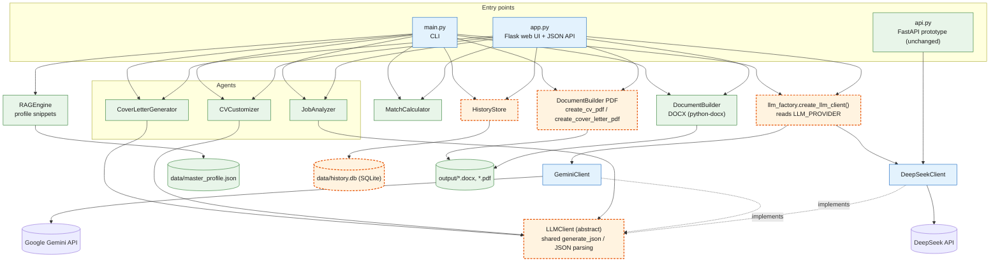

# Job Application Agent (Extended)

> A multi-agent AI system that reads a job description and produces a tailored, ATS-optimized CV and cover letter.

[](https://github.com/Sami123d/job-app-agent-extended/actions/workflows/ci.yml)

This project is a modified, extended version of [**AI-Powered Job Application Agent**](https://github.com/Ismail-2001/AI-Job-Application-Agent) by **Ismail Sajid** ([@Ismail-2001](https://github.com/Ismail-2001)), used and redistributed here under the terms of its MIT License. The original author's copyright notice is kept in [LICENSE](LICENSE), and a second line covers the modifications made here. Nothing in this credit section should be read as this repository's own design, prompts or architecture. See [What Was Changed](#what-was-changed-vs-the-original) below for exactly what is new here.

**The maintainer of this repository did not create the original project.** This is a derivative work. The base multi-agent architecture, prompts, and web/CLI interface are Ismail Sajid's. The items listed below were added on top of that base.

---

## Status

- The pytest suite (28 tests, with a fake LLM client so there are no network calls) runs green in CI on Python 3.11.
- The full app needs a DeepSeek or Gemini API key. It has not been deployed, so there is no live demo and no screenshots. The original web UI was not changed in this fork.

## What This Project Does

Given a job description, the system:
1. Extracts structured requirements, skills, and ATS keywords (`JobAnalyzer` agent)
2. Scores how well the job matches your profile (`MatchCalculator`)
3. Rewrites your CV to emphasize matching experience (`CVCustomizer` agent)
4. Writes a tailored cover letter (`CoverLetterGenerator` agent)
5. Produces both as downloadable documents (DOCX, and PDF in this fork)

## What Was Changed vs. the Original

These are the main changes in this fork. Each one can be explained on its own:

### 1. LLM provider abstraction (`utils/llm_client.py`, `utils/llm_factory.py`)
The original had two separate client classes (`DeepSeekClient`, `GeminiClient`) that were nearly duplicates. Their JSON-parsing logic was copy-pasted, and their method signatures didn't match. `GeminiClient.generate_content` had no `system_instruction` parameter, and its `generate_json` didn't accept the `system_instruction=` keyword that every agent passes. So the Gemini client couldn't be used with the agents as they were written (the original always used DeepSeek). This fork introduces:
- An abstract `LLMClient` base class with a single shared `generate_json` / `_parse_json_safe` implementation.
- Both provider clients now subclass it and share one interface.
- A `create_llm_client()` factory that reads `LLM_PROVIDER` from the environment. Switching providers in `app.py` and `main.py` is now a config change, not a code change.
- Gemini now receives the system instruction through the SDK's model-level `system_instruction` parameter.
- Scope: the separate FastAPI prototype `api.py` (carried over unchanged from the original) still constructs `DeepSeekClient` directly and is not covered by the factory.

### 2. Application history (`utils/history_store.py`)
The original was fully stateless. Every generated CV or cover letter overwrote the previous one, and past runs were not recorded ("Job History Tracking" was an unimplemented item on the original repo's own roadmap). This fork adds:
- A local SQLite-backed store (`data/history.db`) that records the role, company, match score, and output file paths for every run.
- New API endpoints: `GET /api/history`, `GET /api/history/<id>`, `DELETE /api/history/<id>`.
- CLI runs (`main.py`) and web runs (`app.py`) both write to it.
- No frontend UI for browsing history was built in this pass. For now it is available through the API and CLI only.

### 3. PDF export (`utils/document_builder.py`)
The original only produced `.docx` files. This fork adds a parallel PDF pipeline (using `reportlab`) that follows the DOCX layout: `create_cv_pdf()` and `create_cover_letter_pdf()`. Every run now produces both formats.

### 4. Working Docker setup (`Dockerfile`, `docker-compose.yml`)
The original README had Docker deployment instructions, but the repository contained no `Dockerfile`. This fork adds a real `Dockerfile` (Python 3.11-slim, gunicorn) and a `docker-compose.yml`. Neither has been built or run in CI yet.

### 5. Test suite (`tests/`)
The original came with ad hoc manual scripts (`test_system.py`, `test_api.py`) that printed pass/fail to the console instead of running under a test runner. This fork adds a `pytest` suite covering:
- the agents, using a fake LLM client so no network calls are made
- `MatchCalculator`
- `DocumentBuilder`, for both DOCX and PDF output
- `HistoryStore`
- the provider factory

### Removed / not carried over from the source repo
- The original author's personal data (`data/master_profile.json`: name, personal email, phone number) was **not** copied into this repository. Only the anonymized `.template` file is included.
- A `.env.example` in the source repo contained what appeared to be a live Google API key rather than a placeholder. This fork's `.env.example` contains placeholder values only.
- About 15 internal working-session and audit markdown files from the source repo (design session logs, IDE prompt files, implementation status reports) were not carried over. They were development artifacts, not user-facing documentation.

## My contributions

The extension work was imported as **one squashed commit** ([`5eb2dc5`](https://github.com/Sami123d/job-app-agent-extended/commit/5eb2dc5a53986c785d80f00d8a66b1e4c44f305f)), so there is no separate commit for each change. The table links to the files that implement each change.

| Change | Files | Commit |
|---|---|---|
| Provider-agnostic LLM interface + factory | [`utils/llm_client.py`](utils/llm_client.py), [`utils/llm_factory.py`](utils/llm_factory.py), [`utils/deepseek_client.py`](utils/deepseek_client.py), [`utils/gemini_client.py`](utils/gemini_client.py), [`agents/`](agents) (type hints) | squashed in [`5eb2dc5`](https://github.com/Sami123d/job-app-agent-extended/commit/5eb2dc5a53986c785d80f00d8a66b1e4c44f305f) |
| SQLite application history + `/api/history` endpoints | [`utils/history_store.py`](utils/history_store.py), [`app.py`](app.py), [`main.py`](main.py) | squashed in [`5eb2dc5`](https://github.com/Sami123d/job-app-agent-extended/commit/5eb2dc5a53986c785d80f00d8a66b1e4c44f305f) |
| PDF export (reportlab) | [`utils/document_builder.py`](utils/document_builder.py), [`app.py`](app.py), [`main.py`](main.py) | squashed in [`5eb2dc5`](https://github.com/Sami123d/job-app-agent-extended/commit/5eb2dc5a53986c785d80f00d8a66b1e4c44f305f) |
| Dockerfile + Compose | [`Dockerfile`](Dockerfile), [`docker-compose.yml`](docker-compose.yml), [`.dockerignore`](.dockerignore) | squashed in [`5eb2dc5`](https://github.com/Sami123d/job-app-agent-extended/commit/5eb2dc5a53986c785d80f00d8a66b1e4c44f305f) |
| pytest suite (fake LLM client) | [`tests/`](tests), [`pytest.ini`](pytest.ini), [`requirements-dev.txt`](requirements-dev.txt) | squashed in [`5eb2dc5`](https://github.com/Sami123d/job-app-agent-extended/commit/5eb2dc5a53986c785d80f00d8a66b1e4c44f305f) |
| GitHub Actions CI | [`.github/workflows/ci.yml`](.github/workflows/ci.yml) | [`07a209f`](https://github.com/Sami123d/job-app-agent-extended/commit/07a209f91116b399596d2e8f8150f1169439eb0a) |

## Architecture

Green nodes (solid border) are from the original project. Orange nodes (dashed border) were added in this fork. Blue nodes are original but were modified in this fork.



**Legend:** green = original (Ismail Sajid), blue = original but modified here (now uses the factory/interface, writes PDFs and history), orange dashed = added in this fork. The agents' only change is that their type hints now use `LLMClient`.

## Tech Stack

- **Python 3.10+**, Flask
- **DeepSeek** or **Google Gemini** as the LLM backend (selected with `LLM_PROVIDER`)
- `python-docx` + `reportlab` for document generation
- SQLite for local application history
- `pytest` for testing, GitHub Actions for CI

## Installation & Setup

```bash
git clone https://github.com/Sami123d/job-app-agent-extended.git
cd job-app-agent-extended

python -m venv venv
# Windows: venv\Scripts\activate
# macOS/Linux: source venv/bin/activate

pip install -r requirements.txt
```

Create a `.env` file from the template and fill in your own API key:

```bash
cp .env.example .env
```

### Environment variables

| Name | Purpose |
|---|---|
| `LLM_PROVIDER` | `deepseek` (default) or `gemini` |
| `DEEPSEEK_API_KEY` | Required when `LLM_PROVIDER=deepseek` |
| `GOOGLE_API_KEY` | Required when `LLM_PROVIDER=gemini` |
| `FLASK_SECRET_KEY` | Flask session secret. It falls back to a dev default, so set it anywhere other than local use |

Set up your profile:

```bash
python setup_profile.py
# or manually: cp data/master_profile.json.template data/master_profile.json
```

See [PROFILE_SETUP_GUIDE.md](PROFILE_SETUP_GUIDE.md) for details.

## Usage

**Web interface:**
```bash
python app.py
# open http://localhost:5000
```

**CLI:**
```bash
python main.py
```

**Docker:**
```bash
docker compose up --build
```

## Testing

```bash
pip install -r requirements-dev.txt
pytest
```

CI runs the same suite on every push to `main` with dummy API keys ([workflow](.github/workflows/ci.yml)). No real LLM API is called.

## API Reference (Flask `app.py`)

| Method | Endpoint | Description |
|---|---|---|
| GET | `/` | Web UI |
| GET | `/api/profile/check` | Check whether a master profile exists (original) |
| GET / POST | `/api/profile` | Read / save the master profile (original) |
| POST | `/api/linkedin/import` | Import a profile from LinkedIn data (original) |
| POST | `/api/process` | Run the full pipeline. Now also returns PDF paths and an `application_id` (modified) |
| GET | `/api/history` | List recent applications, newest first (**new**) |
| GET | `/api/history/<id>` | Get one application, including the full stored job analysis (**new**) |
| DELETE | `/api/history/<id>` | Delete an application record (**new**) |
| GET | `/api/download/<path>` | Download a generated file (original) |

There is no authentication. The app is meant to run locally.

## Known Limitations / Roadmap

- `api.py` (FastAPI prototype from the original) still uses DeepSeek directly, and `fastapi` isn't in `requirements.txt`.
- No UI for browsing history yet (planned).
- The Docker image isn't built in CI yet.

## License

MIT License. See [LICENSE](LICENSE). Copyright (c) Ismail Sajid for the original work. Modifications in this repository are released under the same license.

## Attribution

- **Original project and architecture:** [Ismail Sajid](https://github.com/Ismail-2001), [AI-Job-Application-Agent](https://github.com/Ismail-2001/AI-Job-Application-Agent)
- **Extended by:** [Sami123d](https://github.com/Sami123d)
